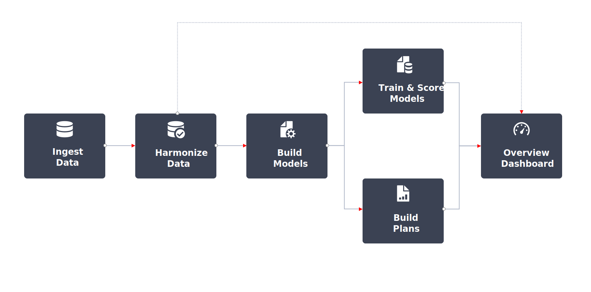

# Adobe组合建模器工作流程

Adobe混合建模器中的典型工作流如下所示：

|  | 活动 | 描述 |
|---|---|---|
| {width="100"} | [**引入数据**](../ingest-data/overview.md) | 从Adobe Experience Platform(例如Adobe Analytics、Web SDK、其他源)摄取事件数据、从营销渠道（例如电视、封闭式花园、电子邮件、自有和运营的活动）摄取聚合数据，以及从客户摄取外部因素数据（例如订阅服务的价格变化）。 |
| {width="100"} | [**协调数据**](../harmonize-data/overview.md) | 配置映射规则和冲突解决规则，以合并在Adobe组合建模器中衡量和规划营销活动绩效所需的各种营销数据集。 |
| {width="100"} | [**配置模型**](../models/create.md) | 使用营销接触点（例如渠道）和转化定义配置模型实例。 |
| {width="100"} | [**训练模型并为其评分**](../models/overview.md) | 使用机器学习训练和评分创建聚合分数和事件级分数。 |
| {width="100"} | [**创建计划**](../plans/overview.md) | 利用Adobe组合建模器模型的输出结果确定营销资金的最佳分配以实现业务目标。 |
| {width="100"} | [**概述仪表板**](../dashboard/overview.md) | 使用各种可配置的构件深入了解协调的数据、模型和计划。 |

{style="table-layout:auto"}

