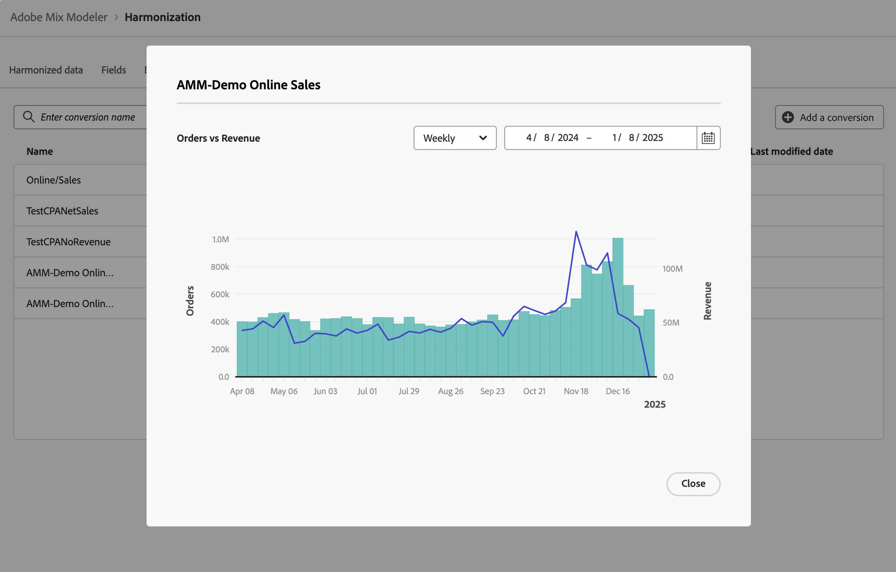

# 转化 {#conversions}

>[!CONTEXTUALHELP]
>id="harmonizeddata_conversions_create"
>title="转化"
>abstract="转化事件是用于识别营销活动影响的业务目标。 例如：电子商务订单、门店购买、网站访问等。"

转化事件是用于识别营销活动影响的业务目标。 示例：电子商务订单、店内购买、网站访问等。

您可以为归因分析定义市场营销转换。

## 管理转换

要查看可用转换的表，请在Mix Modeler界面中执行以下操作：

1. 从左边栏中选择 **[!UICONTROL Harmonized data]**。

1. 从顶栏中选择&#x200B;**[!UICONTROL Conversions]**。 你可以看到一张转换表。

表列指定有关转换的详细信息：

| 列名 | 详细信息 |
| --- | ---|
| 名称 | 转换的名称。 |
| 收入 | 用于计算换算收入的协调数据指标。 |
| 转化量度 | 用作分析的转换度量的协调数据量度。 |
| 类别 | 转换的转换类别。 |
| 已创建 | 创建转换的日期和时间。 |
| 上次修改时间 | 上次修改转换的日期和时间。 |

## 添加转换

要添加转换，请在Mix Modeler的 **[!UICONTROL Harmonized data]** > **[!UICONTROL Conversion]**&#x200B;界面中：

1. 选择 **[!UICONTROL Add a conversion]**。

1. 在&#x200B;**[!UICONTROL Create conversion]**&#x200B;对话框中：

   1. 输入&#x200B;**[!UICONTROL Conversion]**&#x200B;的名称，例如`Store Conversions`。

   1. 定义&#x200B;**[!UICONTROL Conversion category]**。

      1. 从&#x200B;**[!UICONTROL *选择协调……*]**&#x200B;中选择一个值，例如`Conversion types`。

      1. 为运算符选择一个值，例如&#x200B;**[!UICONTROL is]**。

      1. 从&#x200B;**[!UICONTROL *选择值&#x200B;*]**&#x200B;中选择一个值或输入一个值，例如&#x200B;**[!UICONTROL Store]**。

   1. 从&#x200B;**[!UICONTROL Conversion metric for analysis]**&#x200B;中选择协调的字段，例如&#x200B;**[!UICONTROL Orders]**。

   1. 从&#x200B;**[!UICONTROL Revenue field]**&#x200B;中选择协调的字段，例如&#x200B;**[!UICONTROL Gross Demand]**。

   1. 若要创建转换，请选择“**[!UICONTROL Create]**”。 若要取消转换的创建，请选择“**[!UICONTROL Cancel]**”。

      

1. 创建转换后，该转换将添加到转换表中。

## 查看详细信息

要查看折换的详细信息，请执行以下操作：

1. 将鼠标悬停在表中的转换名称上时，选择“”。

1. 选择 **查看详细信息**。 此时将显示一个对话框，其中显示了转换的详细信息。 有关详细信息，请参阅[添加转换](#add-a-conversion)。 选择“**[!UICONTROL Cancel]**”以关闭对话框。

## 查看报告

要查看转换报告，请执行以下操作：

1. 将鼠标悬停在表中的转换名称上时，选择“”。

1. 选择 **查看报告**。 此时将显示一个转换报告。

   

   * 要更改报告的粒度，请从&#x200B;**[!UICONTROL Weekly]**&#x200B;下拉菜单中选择一个值。
   * 要更改要报告的期间，请输入开始日期和结束日期，或使用在日历弹出窗口中定义期间。

1. 选择“**[!UICONTROL Close]**”以关闭对话框。

## 删除转换

要删除转换，请执行以下操作：

1. 将鼠标悬停在表中的转换名称上时，选择 **删除**。
1. 在&#x200B;**[!UICONTROL Delete conversion]**&#x200B;对话框确认对话框中，选择&#x200B;**[!UICONTROL Delete]**&#x200B;以永久删除转换。
