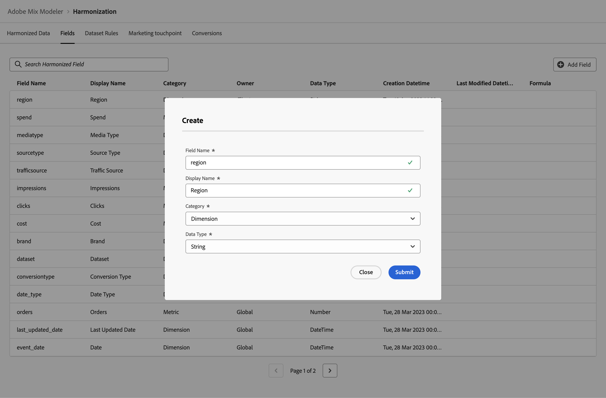

# 协调的字段

协调的字段允许您为概念上相同的数据定义字段，这些数据来自不同的来源，每个来源都有自己对该数据的定义。 例如，可以根据数据源的不同定义和命名点击量度。 点击协调字段允许您根据点击数据的不同来源定义点击量度的通用术语。

协调的字段允许您定义要用作协调数据工作流一部分的字段。 您定义的字段可用于定义数据集规则、营销接触点和转化。

## 全球一体化领域

Mix Modeler中默认可用的全局协调字段包括：

| 字段名称 | 显示名称 | 类别 | 数据类型 | 注释 |
| ---------------------- | ---------------------- | --------- | --------- | --------- |
| 品牌 | 品牌 | 维度 | 字符串 |           |
| 营销活动 | Campaign | 维度 | 字符串 |           |
| 渠道 | 渠道 | 维度 | 字符串 |           |
| channel_id | 渠道ID | 维度 | 字符串 |           |
| channel_type_at_source | 源中的渠道类型 | 维度 | 字符串 |           |
| 渠道 | 渠道 | 维度 | 字符串 |           |
| 点击次数 | 点击次数 | 量度 | 数值 |           |
| conversiontype | 转化类型 | 维度 | 字符串 |           |
| 成本 | 成本 | 量度 | 货币 |           |
| 数据集 | 数据集 | 维度 | 字符串 |           |
| date_type | 日期类型 | 维度 | 字符串 | 天、周 |
| 电子邮件已发送 | 已发送电子邮件 | 量度 | 数值 |           |
| event_date | 日期 | 维度 | 日期时间 |           |
| gross_demand | 总需求 | 量度 | 货币 |           |
| 展示次数 | 嵌入 | 量度 | 数值 |           |
| last_updated_date | 上次更新日期 | 维度 | 日期时间 |           |
| linkvisits | 链接访问 | 量度 | 数值 |           |
| mediatype | 媒体类型 | 维度 | 字符串 |           |
| net_sales | 销售净额 | 量度 | 货币 |           |
| 订单 | 订购 | 量度 | 数值 |           |
| 源类型 | 源类型 | 维度 | 字符串 |           |
| 支出 | 支出 | 量度 | 货币 |           |
| trafficsource | 流量源 | 维度 | 字符串 |           |

{style="table-layout:auto"}

在这些全球统一字段之上，您可以添加、编辑或删除您自己的统一字段。

## 管理协调的字段

要在Mix Modeler界面中查看可用协调字段的表，请执行以下操作：

1. 选择  **[!UICONTROL Harmonized data]** 从左边栏开始。

1. 选择 **[!UICONTROL Fields]** 从顶部栏中。 您会看到协调字段的表。 如果有更多页面可用，请使用  或  在 **[!UICONTROL Page _x _之_x_]** 在表的页面之间移动。

   表格列指定有关协调字段的详细信息

   | 列名称 | 详细信息 |
   | ---------------------- | ----------|
   | 字段名称 | 协调字段的名称。 |
   | 显示名称 | 协调字段的显示名称。 此显示名称在定义数据集规则、营销接触点和转化定义时使用。 |
   | 类别 | 指定协调的数据字段是否为 [!UICONTROL Dimension]， a [!UICONTROL Metric] 或 [!UICONTROL Derived]. 派生类别是使用基于量度的公式定义的协调字段。 |
   | 数据类型 | 指定数据类型([!UICONTROL Number]， [!UICONTROL String]， [!UICONTROL Currency]， [!UICONTROL DateTime])。 |
   | 创建日期 | 创建协调字段的日期和时间。 |
   | 所有者 | 指示协调字段是否为默认字段([!UICONTROL Global])，或由您定义([!UICONTROL Client])。 |
   | 上次修改日期 | 上次修改协调字段的数据和时间。 |
   | 公式 | 指定基于派生类别的协调字段的公式。 |

   {style="table-layout:auto"}

1. 要搜索特定的协调字段，请使用  **[!UICONTROL *搜索协调字段&#x200B;*]**.

### 添加协调字段

为了添加一个统一的字段，请在  **[!UICONTROL Harmonized data]** > **[!UICONTROL Fields]** Mix Modeler界面：

1. 选择  **[!UICONTROL Add field]**.

1. 在 **[!UICONTROL Create]** 对话框：

   1. 输入 **[!UICONTROL Field name]**&#x200B;例如 `region`.
   1. 输入 **[!UICONTROL Display name]**&#x200B;例如 `Region`.
   1. 选择 **[!UICONTROL Category]**： **[!UICONTROL Dimension]**， **[!UICONTROL Metric]** 或 **[!UICONTROL Derived]**.

      当您选择时 **[!UICONTROL Derived]**，指定 **[!UICONTROL Formula]**. 要构建有效的算术表达式，请组合以下项中的一个或多个量度： **[!UICONTROL Insert Metric]** 与一个或多个操作员 **[!UICONTROL + - * / ( )]** . 例如，`[orders]/[impressions]`

   1. 选择 **[!UICONTROL Data type]**.

      - **[!UICONTROL String]** 或 **[!UICONTROL DateTime]**，当选择的类别为Dimension时。
      - **[!UICONTROL Number]** 或 **[!UICONTROL Currency]** 当选择的类别为“量度”或“派生”时。

   1. 选择 **[!UICONTROL Submit]** 添加协调字段。 选择 **[!UICONTROL Close]** 结束对话，但不添加协调字段。

      

### 编辑协调的字段

您只能编辑之前创建的协调字段（所有者是客户）。 您无法编辑全局协调字段。

要编辑协调的字段，请在  **[!UICONTROL Harmonized data]** > **[!UICONTROL Fields]** Mix Modeler界面：

1. 选择要编辑的协调字段。 例如：**[!UICONTROL Region]**。

1. 在 **[!UICONTROL Edit harmonization values]** 窗格，修改值 **[!UICONTROL Display name]**， **[!UICONTROL Category]**、和 **[!UICONTROL Data type]**. 请参阅 [添加协调字段](#add-a-harmonized-field) 以了解更多信息。

1. 选择 **[!UICONTROL Submit]** 将更改应用于协调字段。

   

### 删除协调字段

您只能删除之前创建的协调字段（所有者即客户）。 您不能删除全球协调字段。

要删除协调字段，请在  **[!UICONTROL Harmonized data]** > **[!UICONTROL Fields]** Mix Modeler界面：

1. 例如，选择要删除的协调字段 **[!UICONTROL Region]**.

1. 选择  **[!UICONTROL Delete]** 从 **[!UICONTROL Edit harmonization values]** 左窗格。

   >[!WARNING]
   >
   >   该字段将立即删除。

