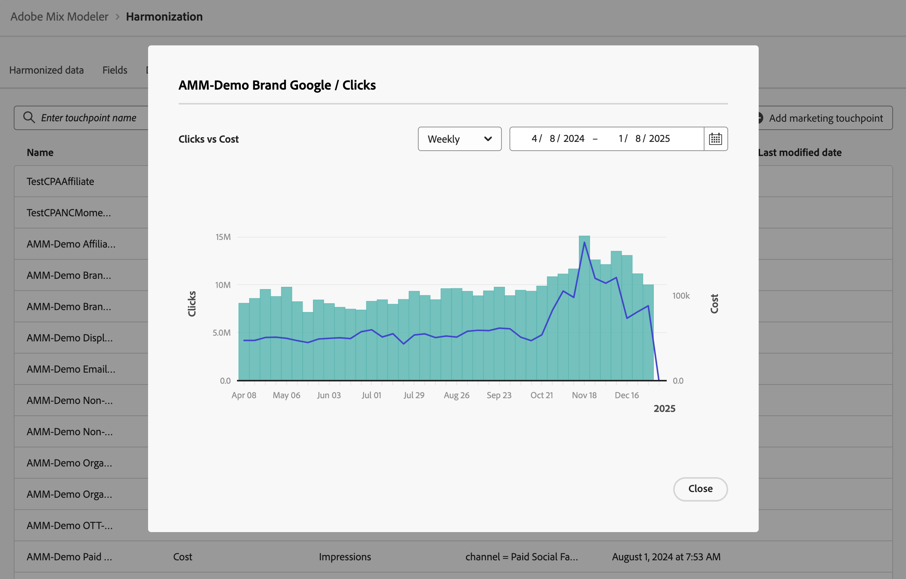

# 市场营销接触点 {#marketing-touchpoints}

>[!CONTEXTUALHELP]
>id="harmonizeddata_marketingtouchpoint"
>title="市场营销接触点"
>abstract="市场营销接触点是接收者、个人和/或 cookie 级别的市场营销事件，用于评估营销投资对基于数字或基于收入的转化率的影响。"

市场营销接触点是接收者、个人和/或 cookie 级别的市场营销事件，用于评估营销投资对基于数字或基于收入的转化率的影响。

您可以定义营销接触点来帮助您进行归因分析。

## 管理营销接触点

要在Mix Modeler界面中查看可用的营销接触点表，请执行以下操作：

1. 从左边栏中选择 **[!UICONTROL Harmonized data]**。

1. 从顶部栏中选择&#x200B;**[!UICONTROL Marketing touchpoint]**。 您会看到营销接触点表。 如果有更多页面可用，请使用的上的&#x200B;**[!UICONTROL Page _向左箭头&#x200B;_或_向右箭头_]**&#x200B;在表的页面之间移动。

表列指定有关营销接触点的详细信息：

| 列名称 | 详细信息 |
| --- | ---|
| 名称 | 营销接触点的名称。 |
| 支出量度 | 用于计算接触点支出的协调数据指标。 |
| 数量指标 | 用于计算接触点数量的协调数据指标。 |
| 规则 | 要使用的接触点规则。 |
| 已创建 | 创建营销接触点的日期和时间。 |
| 上次修改时间 | 上次修改营销接触点的日期和时间。 |

## 添加营销接触点

要添加营销接触点，请在Mix Modeler的 **[!UICONTROL Harmonized data]** > **[!UICONTROL Marketing touchpoint]**&#x200B;界面中：

1. 选择添加营销接触点。

1. 在&#x200B;**[!UICONTROL Marketing touchpoint]**&#x200B;对话框中。

   1. 输入&#x200B;**[!UICONTROL Touchpoint Name]**&#x200B;的名称，例如`Luma Touchpoint`。

   1. 定义&#x200B;**[!UICONTROL Touchpoint rule]**。

      1. 从&#x200B;**[!UICONTROL *选择协调的&#x200B;*]**&#x200B;中选择一个值，例如&#x200B;**[!UICONTROL Brand]**。

      1. 为运算符选择一个值，例如&#x200B;**[!UICONTROL is]**。

      1. 从&#x200B;**[!UICONTROL *中选择值&#x200B;*]**&#x200B;或输入值，例如&#x200B;**[!DNL Luma]**。

   1. 从&#x200B;**[!UICONTROL Touchpoint volume]**&#x200B;中选择协调字段，例如&#x200B;**[!UICONTROL Impressions]**。

   1. 从&#x200B;**[!UICONTROL Touchpoint spend]**&#x200B;中选择协调字段，例如&#x200B;**[!UICONTROL Cost]**。

      

   1. 要创建营销接触点，请选择&#x200B;**[!UICONTROL Create]**。 要取消创建营销接触点，请选择&#x200B;**[!UICONTROL Cancel]** 。

1. 创建后，接触点将添加到营销接触点表中。

## 查看详细信息

要查看营销接触点的详细信息，请执行以下操作：

1. 将鼠标悬停在表中的营销接触点名称上时，选择。

1. 选择 **视图**。 此时一个对话框会显示营销接触点的详细信息。 有关详细信息，请参阅[添加营销接触点](#add-a-marketing-touchpoint)。 选择&#x200B;**[!UICONTROL Cancel]**&#x200B;关闭对话框。

## 查看报告

要查看营销接触点报表，请执行以下操作：

1. 将鼠标悬停在表中的营销接触点名称上时，选择。

1. 选择 **查看报告**。 对话框会显示营销接触点的报告。

   

   * 要更改报告的粒度，请从&#x200B;**[!UICONTROL Weekly]**&#x200B;下拉菜单中选择一个值。
   * 若要更改要报告的期间，请输入开始和结束日期，或使用在日历弹出窗口中定义期间。

1. 选择&#x200B;**[!UICONTROL Close]**&#x200B;关闭对话框。

## 删除营销接触点

要删除营销接触点，请执行以下操作：

1. 将鼠标悬停在表中的营销接触点名称上时，选择 **删除**。
1. 在&#x200B;**[!UICONTROL Delete touchpoint]**&#x200B;对话框确认对话框中，选择&#x200B;**[!UICONTROL Delete]**&#x200B;以永久删除营销接触点。

