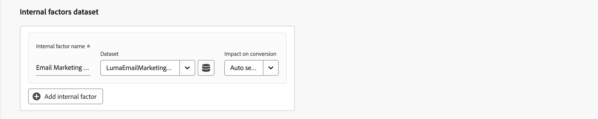

# 创建模型

要创建模型，请在  **[!UICONTROL Models]** 界面中，选择Mix Modeler **[!UICONTROL Open model canvas]**.

为了构建自定义AI支持的模型，界面提供了分步引导式模型配置流程。

1. 在 **[!UICONTROL Setup]** 步骤：

   1. 输入您的模型 **[!UICONTROL Name]**&#x200B;例如 `Demo model`. 输入 **[!UICONTROL Description]**&#x200B;例如 `Demo model to explore AI featues of Mix Modeler`.

      

   1. 选择 **[!UICONTROL Next]** 以继续执行下一步。 选择 **[!UICONTROL Cancel]** 以取消模型配置。

1. 在 **[!UICONTROL Configured]** 步骤：

   1. 在 **[!UICONTROL Conversion goal]** 部分，在容器中：

      1. 输入 **[!UICONTROL Conversion name]** 例如，对于转换 `Conversion`

      1. 从以下项中选择转换 **[!UICONTROL *选择协调字段&#x200B;*]**，其中包含您定义为的一部分可用的转化 [转化](../harmonize-data/conversions.md) 在 [!UICONTROL Harmonized datasets]. 例如：**[!UICONTROL Online Conversion]**。

      1. 您可以选择  **[!UICONTROL Create new conversion]** 直接在模型配置中创建转换。

         

   1. 在 **[!UICONTROL Marketing touchpoints]** 部分中，您会看到多个营销接触点容器，这些容器与您定义为其中一部分的营销接触点相对应 [营销接触点](../harmonize-data/marketing-touchpoints.md) 在 [!UICONTROL Harmonized datasets].

      * 对于每个容器：

         1. 您可以修改 **[!UICONTROL Marketing touchpoint name]**.

         1. 从中选择营销接触点 **[!UICONTROL _选择营销接触点_]**.

         1. 您可以选择  **[!UICONTROL Create new marketing touchpoint]** 直接在模型配置中创建营销接触点。

      * 要添加营销接触点容器，请选择  **[!UICONTROL Add marketing touchpoint]**.

      * 要删除营销接触点容器，请在容器中选择 ，并选择 **[!UICONTROL Remove container]** 从上下文菜单中。

        

   1. 默认情况下，会对您协调视图中的所有数据生成一个分数。 要仅对群体的子集进行评分，请使用中的容器定义一个或多个过滤器 **[!UICONTROL Eligible data population]** 部分。

      * 对于每个容器，定义一个或多个事件。

         1. 对于每个事件：

            1. 从中选择量度或维度 **[!UICONTROL _选择协调字段_]**.

            1. 选择相应的运算符： **[!UICONTROL equals]**， **[!UICONTROL not equals]**， **[!UICONTROL less than]**， **[!UICONTROL greater than]**， **[!UICONTROL starts with]**， **[!UICONTROL doesn't start with]**， **[!UICONTROL ends with]**， **[!UICONTROL doesn't end with]**， **[!UICONTROL contains]**， **[!UICONTROL doesn't contain]**， **[!UICONTROL is in]**，或 **[!UICONTROL is not in]**.

            1. 在以下位置输入或选择一个值： **[!UICONTROL _输入或选择值_]**.

         1. 要在容器中添加其他事件，请选择  **[!UICONTROL Add event]**.

         1. 要从容器中删除事件，请选择 .

         1. 要使用容器中定义的所有或多个事件进行筛选，请选择 **[!UICONTROL Any of]** 或 **[!UICONTROL All of]**. 标签会相应地从 **[!UICONTROL Include ... Or ...]** 到 **[!UICONTROL Include ... And ...]**.

      * 要添加符合条件的数据填充容器，请选择  **[!UICONTROL Add eligible population]**.

      * 要删除符合条件的数据群体容器，请在容器中选择 ，并选择 **[!UICONTROL Remove container]** 从上下文菜单中。

        

   1. 要将包含外部因素的数据集添加到模型中，请在 **[!UICONTROL External factors dataset]** 部分。

      * 对于每个容器：

         1. 输入 **[!UICONTROL Factor name]** 在 **[!UICONTROL _输入因子_]**.

         1. 从中选择数据集 **[!UICONTROL _选择数据集_]**. 您可以选择  以管理数据集。 请参阅 [数据集](../ingest-data/datasets.md) 以了解更多信息。

      * 要添加额外的外部因素数据集容器，请选择  **[!UICONTROL Add external factor]**.

      * 要删除外部因子数据集容器，请在容器中选择 ，并选择 **[!UICONTROL Remove container]** 从上下文菜单中。

        

   1. 要将包含内部因子的数据集添加到模型中，请在以下位置使用一个或多个容器： **[!UICONTROL Internal factors dataset]** 部分。

      * 对于每个容器：

         1. 输入 **[!UICONTROL Factor name]** 在 **[!UICONTROL _输入因子_]**.

         1. 从中选择数据集 **[!UICONTROL _选择数据集_]**. 您可以选择  以管理数据集。 请参阅 [数据集](../ingest-data/datasets.md) 以了解更多信息。

      * 要添加其他内部因素数据集容器，请选择  **[!UICONTROL Add internal factor]**.

      * 要删除其他内部因子数据集容器，请在容器中选择 、和 **[!UICONTROL Remove container]** 从上下文菜单中。

        

   1. 要定义模型的回顾时间范围，请输入一个值，其范围介于 `1` 和 `52` 在 **[!UICONTROL Give contribution credit to touchpoints occurring within]** ... **[!UICONTROL weeks prior to the conversion]**.

   1. 选择 **[!UICONTROL Next]** 以继续执行下一步。 如果需要更多配置，请使用红色轮廓和文本说明需要哪些其他配置。  选择 **[!UICONTROL Back]** 以返回到上一步。  选择 **[!UICONTROL Cancel]** 以取消模型配置。

1. 在 **[!UICONTROL Advanced]** 步骤：

   1. 在 **[!UICONTROL Define training window]** 部分，选择范围

      * **[!UICONTROL Have Mix Modeler select a helpful training window]** 和

      * **[!UICONTROL Manually input a training window]**&#x200B;的问题。选中后，定义年数 **[!UICONTROL Include events the following years prior to a conversion]**.

        

   1. 在 **[!UICONTROL Spend share]** 部分：

      * 要在营销数据稀疏时使用历史营销投资比率通知模型，请激活 **[!UICONTROL Allow spend share]**.

   1. 在 **[!UICONTROL Prior knowledge]** 部分：

      1. 选择 **[!UICONTROL Rule type]**。

      1. 指定下面列出的任何渠道的贡献百分比 **[!UICONTROL Name]**，使用 **[!UICONTROL Contribution proportion]** 列。

      1. 在适当时，您可以为每个渠道添加 **[!UICONTROL Level of confidence]** 百分比。

      1. 需要时，使用 **[!UICONTROL Clear all]** 要清除 **[!UICONTROL Contribution proportion]** 和 **[!UICONTROL Level of confidence]** 列。

         

1. 选择 **[!UICONTROL Finish]** 完成模型配置。

   * 在 **[!UICONTROL Create instance?]** 对话框，选择 **[!UICONTROL Ok]** 立即触发第一组训练和评分运行。 您的模型将以状态列出 ● **[!UICONTROL Awaiting training]**。

     选择 **[!UICONTROL Cancel]** 以取消。

   * 如果需要更多配置，请使用红色轮廓和文本说明需要哪些其他配置。

   选择 **[!UICONTROL Back]** 以返回到上一步。

   选择 **[!UICONTROL Cancel]** 以取消模型配置。
