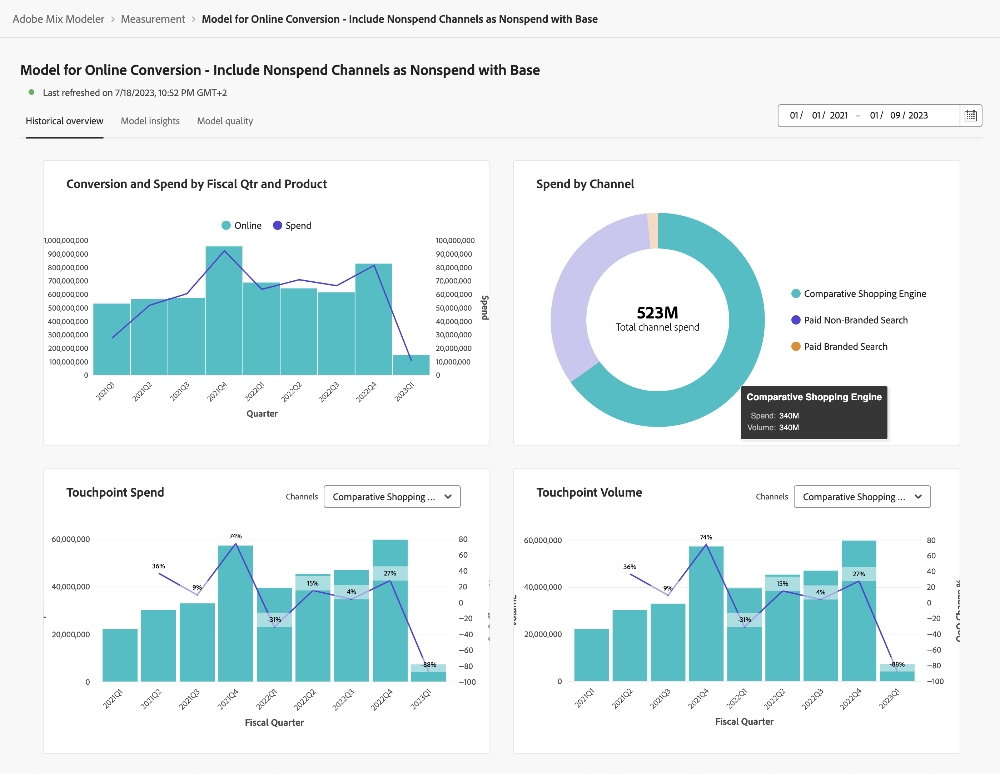

# 模型分析

要查看模型洞察，请在  **[!UICONTROL Models]** 界面Mix Modeler：

1. 选择模型名称 **[!UICONTROL Last run status]** 之 ● **[!UICONTROL Success]** 从 **[!UICONTROL Models]** 表格。

1. 从上下文菜单中，选择 **[!UICONTROL Model Insights]**.

您会看到指定模型的上次刷新时间，并且小组件使用三个选项卡显示：历史概述、模型洞察和模型质量。

您可以更改每个选项卡上的小组件所基于的日期段。 输入日期期间或选择  以选择日期期间。

## 历史概述

“历史概述”选项卡显示以下各项的小部件：

* 按财政季度和产品划分的转化和支出。

* 按渠道支出。

* 接触点支出。

  您可以为此小组件选择一个要显示的基于支出的替代渠道。 从中选择渠道 **[!UICONTROL Channels]**.

* 接触点数量。

  您可以选择为此小组件显示的替代的基于卷的渠道。 从中选择渠道 **[!UICONTROL Channels]**.

## 模型洞察

模型分析选项卡显示以下构件：

* 按日期和基本媒体列出的贡献。 栈叠的图表按顺序排列：底部为基数，中间为非支出渠道，顶部为支出渠道。

* 按渠道列出的贡献。

* 营销绩效摘要。

* 边际响应曲线。

您可以将鼠标悬停在每个小组件中的单个图表元素上，以显示包含更多详细信息的弹出框。

要下载包含构件数据的CSV文件，请选择 .

要以Microsoft®Excel格式下载完整的模型分析数据，请选择  **[!UICONTROL Download data]**.

## 模型质量

模型质量选项卡显示

* [!UICONTROL Model Assessment] 可视化，可按实际转化与预测转化或残差转化进行划分。

  要划分可视化图表，请选择 **[!UICONTROL Actual vs. Predicted]** 或 **[!UICONTROL Residuals]** 从 **[!UICONTROL Breakdown]** 列表。

* [!UICONTROL Model fitting metrics] 表，其中显示每个转化指标的以下列：

   * 实际转化

   * 模型化转化

   * 剩余转化（实际转化与模型转化之间的差异）

   * 模型质量得分值：

      * R2（R平方），它表明数据拟合回归模型（拟合优度）的程度。

      * MAPE（平均绝对误差百分比），最常用于测量预测准确度的KPI之一，它以实际值的百分比表示预测误差。

      * RMSE（均方根误差）：显示平均“误差”，根据误差的平方进行加权。

  要下载包含该表数据的CSV文件，请选择 .
