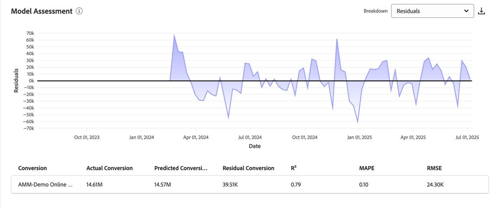

# 模型洞察

模型分析中的每个可视化图表都旨在帮助您：

* 可视化并量化组织营销活动的影响。
* 确定哪些渠道表现良好。
* 确定可能需要优化的渠道。

然后，这些见解可帮助您支持资源优先顺序和分配。

要查看模型分析，请在Mix Modeler的 **[!UICONTROL Models]**&#x200B;界面中：

1. 从&#x200B;**[!UICONTROL Models]**&#x200B;表中，选择&#x200B;**[!UICONTROL Last run status]**&#x200B;为 **[!UICONTROL Success]**&#x200B;的模型的名称。

1. 从上下文菜单中选择&#x200B;**[!UICONTROL Model Insights]**。

可以使用以下选项卡：

* [模型洞察](#model-insights)
* [渠道协同](#channel-synergy)
* [因素](#factors-beta) [!BADGE 测试版]
* [归因](#attribution)（仅适用于启用MTA的模型）
* [诊断](#diagnostics)
* [历史概述](#historical-overview)。

您可以更改每个选项卡上的可视化图表所基于的日期段。 输入日期期间或选择以选择日期期间。

## 模型漂移

{{release-limited-testing-section}}

如果在模型上检测到模型漂移，您会看到&#x200B;**[!UICONTROL Model drift detected]**&#x200B;对话框，其中包含稍后提醒或立即[**[!UICONTROL Retrain]**](overview.md#retrain)模型的选项。 如果选择&#x200B;**[!UICONTROL Remind me later]**，则会在第二天或下次登录时提醒您。

## [!UICONTROL Model insights]

“模型分析”选项卡显示[按日期和基本媒体列出的贡献](#contribution-by-date-and-base-media)、[按渠道列出的贡献](#contribution-by-channel)、[营销绩效摘要](#marketing-performance-summary)和[边际响应曲线](#marginal-response-curves)的可视化图表。 该选项卡还提供[接触点细分](#touchppint-breakdown)表。

* 您可以将鼠标悬停在每个可视化图表中的单个图表元素上，以显示包含更多详细信息的弹出框。

* 要下载包含可视化图表数据的CSV文件，请选择。

* 要以Microsoft® Excel格式下载完整的模型分析数据，请选择 **[!UICONTROL Download data]**。

### 按日期和基本媒体列出的贡献

此栈叠图形可视化图表的顺序如下：

* 底部显示基座。
* 非支出渠道显示在中间。
* 支出渠道显示在顶部。

此可视化图表表示在某个日期范围内按基础、支出渠道和非支出渠道实现的贡献比例。 此可视化图表有助于展示增量功能。 基本信息表示在没有任何营销的情况下会发生什么，非支出渠道加上支出渠道（在基本信息的基础上）归因于营销影响。 简言之，非支出加支出等于营销工作的增量影响，可视化图表可让您轻松了解insight营销产生的价值。

### 按渠道显示的贡献

一个圆环图可视化图表，可显示各个渠道的贡献分布。 此可视化图表通过前三个执行渠道的镜头（不包括基本和&#x200B;*所有其他*&#x200B;类别）展示递增性。 该可视化图表有助于支持优先级和预算分配。

### 营销绩效摘要 {#marketing-performance-summary}

>[!CONTEXTUALHELP]
>id="models_insights_undefinedchannels"
>title="未定义渠道"
>abstract="包含未定义的渠道，但没有归因转化。"

可按每个渠道显示ROI或CPA绩效的水平条形图可视化图表。 此可视化图表突出显示您的营销投资的ROI/CPA。 根据ROI / CPA ，这些渠道按降序排名。 可视化有助于识别哪些渠道最有效以及哪些渠道可能需要优化。

未定义的渠道包含在可视化中，但没有归因转化。

### 边际响应曲线

折线图可可视化并比较营销渠道投资产生的边际回报。  并找出当前的支出点和边际盈亏平衡点（即增量回报小于增量支出）。 因此，此可视化图表可帮助您了解营销投资何时开始变得不那么有影响力。

曲线、当前支出点、边际盈亏平衡点以及相应的值是根据所选数据范围和所选渠道计算的。

要更改渠道，请执行以下操作：

* 从&#x200B;**[!UICONTROL Channel]**&#x200B;下拉菜单中选择一个渠道以更新特定渠道的可视化图表。

### 接触点细分

接触点细分表以周为单位显示所有或选定渠道的每周接触点细分，显示与每个渠道关联的关键量度。 该表允许在更精细的渠道级别轻松进行比较、趋势识别和性能跟踪。 此表明确补充了[按日期和基本媒体列出的贡献](#contribution-by-date-and-base-media)可视化图表和[按渠道列出的贡献](#contribution-by-channel)可视化图表。

以下列可用：

| 列 | 描述 |
|---|---|
| **[!UICONTROL Date range]** | 要报告的周。 |
| **[!UICONTROL Touchpoint]** | 特定的接触点渠道。 |
| **[!UICONTROL ROI]** | (**[!UICONTROL Revenue]** - **[!UICONTROL Spend]**) / **[!UICONTROL Spend]**&#x200B;的百分比。 |
| **[!UICONTROL Revenue]** | 日期范围的收入。 |
| **[!UICONTROL CPA]** | **[!UICONTROL Spend]** / **[!UICONTROL Conversions]**。 |
| **[!UICONTROL Conversions]** | 日期范围的转化。 |
| **[!UICONTROL Spend]** | 数据范围的支出。 |

要选择特定渠道或所有渠道，请从&#x200B;**[!UICONTROL View]**&#x200B;下拉菜单中选择。

要下载接触点划分表的内容，请选择 **[!UICONTROL Download CSV]**。

## 渠道协同

在&#x200B;**[!UICONTROL Channel synergy]**&#x200B;选项卡中，**[!UICONTROL Channel synergies]**&#x200B;可视化图表可帮助您识别营销渠道如何交互以创建乘性效果，而不只是单个渠道的贡献。

热图矩阵提供支出渠道对之间协同值的视觉表示。 此矩阵可帮助营销人员了解渠道如何交互以提高性能。 对于每个模型，协同值都从0到10进行了标准化。 这些值量化了&#x200B;*下一美元协同效应*，该协同效应估计了两个渠道在各自收到当前级别的一美元额外支出时如何有效地协同工作。

这一新美元框架提供了相对协同强度的现实衡量标准，因为该框架考虑到培训数据中的实际支出条件，从而能够作出更明智的优化决策。

要下载表示矩阵的CSV文件，请选择 **[!UICONTROL Download]**。

>[!NOTE]
>
>如果现有模型的&#x200B;**[!UICONTROL Channel synergy]**&#x200B;选项卡不可见，请确保重新训练模型以启用功能和可视化。

## **[!UICONTROL Factors]** [!BADGE 测试版] {#factors}

>[!CONTEXTUALHELP]
>id="models_factors_factorcontributionbreakdown"
>title="因子贡献细分"
>abstract="因子贡献细目显示可归因于模型中所包含的各种因子的基础转化率比例。  纯基表示与模型中包含的营销接触点和因素无关的基础转化。 其中包括由品牌价值、重复购买、有机需求以及长期市场趋势和季节性因素驱动的转化。"

因子[!BADGE beta]选项卡显示外部因子相关见解。

此可视化图表可帮助您了解各种内部和外部因素对转化基线的增量影响。 例如，经济条件或促销活动。

使用&#x200B;**[!UICONTROL Factors]**&#x200B;下拉菜单选择要显示的因子。

<!-- need to update the image when we do have a proper example -->

要下载包含该表数据的CSV文件，请选择。

如果没有可用数据，您会看到一条消息 **[!UICONTROL No data is available, you may need to retrain your model, or change the date range to view insights]**。

## [!UICONTROL Attribution] {#attribution}

>[!CONTEXTUALHELP]
>id="models_attribution_breakdownbychannel"
>title="按渠道细分"
>abstract="**[!UICONTROL Breakdown by channel]**&#x200B;是根据客户体验事件架构，按定义的接触点的渠道类型划分的。 选择和&#x200B;**[!UICONTROL Breakdown by touchpoint]**&#x200B;以按接触点显示细分。"

>[!CONTEXTUALHELP]
>id="models_attribution_breakdownbytouchpointposition"
>title="按接触点位置细分"
>abstract="此可视化图表按接触点的位置和所有转化路径上的接触点显示已归因转化的细分。 该可视化图表会比较接触点在某个位置的贡献是否优于其余位置以及在任何位置的其他接触点。 请注意，某个归因模型在所有接触点和位置上的贡献百分比总和将等于100。 初学者、影响者和完成者职位定义如下：<ul><li>**简易版**：指示接触点是否为转化路径中的首次触点。</li><li>**播放器**：指示接触点是否不是导致转化的第一个或最后一个触点。</li><li>**终结点**：指示接触点是否为转换前的末次触点。</li></ul>"

>[!NOTE]
>
>“归因”选项卡仅适用于启用MTA的模型。

使用[!UICONTROL Attribution]选项卡，您可以了解具有事件级别数据的接触点和营销活动的有效性。  请参阅[构建模型](build.md)。

支持以下归因模型：

* 基于Mix Modeler中选择的模型：
   * 算法 — 影响输出
   * 算法 — 增量
* 基于规则：
   * 衰减单位
   * 首次接触
   * 最后接触
   * 线性
   * Ushape

有关Mix Modeler中的多点接触归因功能的介绍，请参阅[多点接触归因](../get-started/about.md#multi-touch-attribution)。

从&#x200B;**[!UICONTROL Attribution Model]**&#x200B;下拉菜单中选择一个或多个归因模型。 选定的归因模型适用于归因选项卡中的所有可视化图表。

Mix Modeler多点接触归因粒度事件得分与总体Mix Modeler得分和ROI相符。 这些得分也可作为Experience Platform中的数据集使用。

归因选项卡包含以下可视化图表：

### [!UICONTROL Overview]

[!UICONTROL Overview]可视化图表显示选定归因模型的转化合计和百分比。 选择更多模型会为可视化图表添加其他圆，每个圆都有自己的颜色与图例相对应。

要查看包含归因模型详细信息的弹出窗口，请将光标悬停在可视化图表中的任何圆圈上。

### [!UICONTROL Trends]

[!UICONTROL Daily trends]、[!UICONTROL Weekly trends]或[!UICONTROL Monthly trends]可视化图表显示选定归因模型的每日、每周或每月转化趋势。

要选择句点，请从&#x200B;**[!UICONTROL Daily trends]**&#x200B;更多&#x200B;**[!UICONTROL Weekly trends]**&#x200B;中选择&#x200B;**[!UICONTROL Monthly trends]**、。

要查看详细信息，请将鼠标悬停在特定归因模型的数据行上以显示一个弹出窗口，其中显示该数据的转化总数。

### [!UICONTROL Breakdown]

[!UICONTROL Breakdown]可视化图表按渠道或接触点划分每个所选归因模型的转化。 此可视化图表有助于确定每个渠道或接触点的有效性。

要选择划分类型，请从&#x200B;**[!UICONTROL Breakdown by channel]**&#x200B;更多&#x200B;**[!UICONTROL Breakdown by touchpoint]**&#x200B;中选择。

要查看详细信息，请将鼠标悬停在任何图表元素上。

### [!UICONTROL Top campaigns]

热门促销活动可视化图表显示排名最前的促销活动列表，其中包含“促销活动名称”、“渠道”、“媒体类型”和“增量转化”列。 此可视化图表有助于让您的团队了解特定渠道的特定营销活动的有效性，并深入了解您应该进一步投资哪些营销活动。

要按“渠道”、“媒体类型”或“增量转化”的升↑或降序↓序对表进行排序，请选择列标题并切换排序。

要在单独的对话框中展开表，请从&#x200B;**[!UICONTROL Expand]**&#x200B;更多。

展开的“热门促销活动”对话框显示的表格及其添加列

* 增量转化
* 受影响的转化
* 首次触点转化
* 最近联系转化

  您可以选择每个附加的列标题，以按升序或降序对表进行排序。

要关闭展开的“热门促销活动”对话框，请选择&#x200B;**[!UICONTROL Close]**。

### [!UICONTROL Breakdown by touchpoint position]

[!UICONTROL Breakdown by touchpoint position]可视化图表是按接触点位置及所有转化路径上的接触点划分的已归因转化。 此图表可帮助您比较某个接触点在某个位置的贡献是否优于其他位置以及在任何位置的其他接触点。

>[!NOTE]
>
>归因模型在所有接触点和位置的贡献百分比之和应等于100。

职位[!UICONTROL Starter]、[!UICONTROL Player]和[!UICONTROL Closer]的定义如下：

| 位置 | 描述 |
|---|---|
| [!UICONTROL Starter] | 此位置指示接触点是否为转化路径中的首次触点。 |
| [!UICONTROL Player] | 此位置指示接触点不是导致转化的首次接触还是最后接触。 |
| [!UICONTROL Closer] | 此位置指示接触点是否为转化前的最后一次触点。 |

### [!UICONTROL Top conversion paths]

[!UICONTROL Top conversion paths]可视化图表根据选定的归因模型显示前5个转化路径。

对于每个转换路径，您会看到：

* 有影响的渠道的数量，
* 已归因路径总数，
* 此转化路径的已归因路径与已归因路径总数的百分比，
* 对于每个渠道，归因模型贡献百分比和
* 这些渠道归因模型贡献百分比的总和。

## [!UICONTROL Diagnostics] {#diagnostics}

>[!CONTEXTUALHELP]
>id="models_diagnostics_modelassessment"
>title="模型评估图"
>abstract="模型评估显示了细分为实际转化率与预测或残差转化率的对比。"
>additional-url="https://experienceleague.adobe.com/zh-hans/docs/mix-modeler/using/overview" text="Mix Modeler 概述"
>additional-url="https://video.tv.adobe.com/v/3440794/?learn=on&enablevpops" text="Mix Modeler 演示"

>[!CONTEXTUALHELP]
>id="models_diagnostics_modeltrainingfitmetrics"
>title="模型拟合量度"
>abstract="显示多个模型训练适合量度的概述。"

>[!CONTEXTUALHELP]
>id="models_diagnostics_pathstouched"
>title="接触的路径"
>abstract="接触的路径是指每个接触点上实现了转化的路径百分比与未实现转化的路径百分比。"

>[!CONTEXTUALHELP]
>id="models_diagnostics_efficiencymeasure"
>title="效率衡量"
>abstract="算法归因模型生成的效率度量指示接触点对转化的相对重要性，独立于接触点数量。 这是在1到5分之间来衡量。 请注意，接触点数量越大并不能保证效率测量值越高。"

>[!CONTEXTUALHELP]
>id="models_diagnostics_totalvolume"
>title="总量"
>abstract="总量是用户接触接触点的总次数，包括出现在实现转化的路径上的接触点以及未导致转化的路径。"

>[!CONTEXTUALHELP]
>id="models_diagnostics_modeldateinfo"
>title="模型日期截至"
>abstract="此表的数据仅为特定时间段生成。**[!UICONTROL As of]**&#x200B;日期表示生成数据的时间，且以startDate到endDate的数据为基础。"

**[!UICONTROL Diagnostics]**&#x200B;选项卡显示以下各项的可视化图表：

* **[!UICONTROL Model Assessment]**&#x200B;可视化图表包括：

  

   * 可按实际转化与预测转化或残差转化进行细分的图表。
要划分可视化图表，请从&#x200B;**[!UICONTROL Breakdown]**&#x200B;列表中选择以下选项之一。

      * **[!UICONTROL Actual vs Predicted]**：此选项将实际值与模型预测进行比较。 理想情况下，预测值应与实际值紧密一致，但会有一些偏差。 较大或系统的偏差或模式可能表示缺少的关系和数据或潜在的偏差。

      * **[!UICONTROL Residuals]**：此选项显示实际值和预测值之间的差异。 一个性能良好的模型具有随机分布的残差，没有清晰的模式或增加的传播。 结构化的趋势或不断扩大的残差可能表明缺少关系和数据，或存在差异问题。

   * 显示每个转化量度的以下列的表：

      * **[!UICONTROL Actual Conversion]**
      * **[!UICONTROL Predicted Conversion]**
      * **[!UICONTROL Residual Conversion]**
      * **[!UICONTROL R2]**，一个分数，它表明数据与回归模型的拟合程度（拟合程度）。
      * **[!UICONTROL MAPE]** （平均绝对百分比误差），这是最常用于测量预测准确度的KPI之一，它以实际值的百分比表示预测误差。
      * **[!UICONTROL RMSE]** （均方根误差）：显示平均误差，根据误差的平方进行加权。

  要下载包含该表数据的CSV文件，请选择。

* 为每个转化量度显示的&#x200B;**[!UICONTROL Model training fit metrics]**&#x200B;表：

  

   * **[!UICONTROL Training R2]**：指示模型预测解释的实际值中差异的比例，从0到1。
   * **[!UICONTROL Training sMAPE]** （对称平均绝对百分比错误）：测量训练数据的平均百分比错误。 值越低表示精度越高。
   * **[!UICONTROL Training RMSE]** （均方根错误）：测量训练数据的平均百分比错误。 惩罚比MAPE更大的错误。 RMSE越低表明预测准确度越高，但对离群值比较敏感。
   * **[!UICONTROL Out-of-sample sMAPE]**：评估不可见数据的百分比错误，平衡预测过多和预测不足。 有助于评估泛化性。 目前，Mix Modeler使用上一季度培训数据作为维持集来评估百分比错误。
   * **[!UICONTROL Out-of-sample RMSE]**：评估不可见数据的百分比错误，平衡预测过多和预测不足。 帮助评估泛化性。 目前，Mix Modeler使用上一季度培训数据作为维持集来评估百分比错误。 RMSE比MAPE更严重地惩罚错误。

* **[!UICONTROL Touchpoint effectiveness]**&#x200B;表，表示归因人工智能算法模型的结果。

  

  此表的数据仅为特定时间段生成。 选择&#x200B;**[!UICONTROL As of *xx/xx/xx， xx:xx TZ *]**以了解更多详细信息。

  该可视化图表按降序显示每个接触点的[!UICONTROL Efficiency measure] ：

   * **[!UICONTROL Paths touched]**：可视化实现转化的路径百分比和未实现转化的路径百分比。 对于接触点，当归因转化率较高时，您会看到更多归因转化。 此比率将导致转化的路径百分比与&#x200B;*不会*&#x200B;导致转化的路径百分比进行比较。
   * **[!UICONTROL Efficiency measure]**：由算法归因模型生成，效率度量指示接触点对转化的相对重要性，与接触点数量无关。 效率在1到5的刻度上测量。 请注意，接触点数量越大并不能保证效率测量值越高。
   * **[!UICONTROL Total volume]**：用户接触接触点的总次数。 该数字包括出现在实现转化的路径上的接触点以及导致转化的路径&#x200B;*而非*。

### 模型漂移检测

>[!AVAILABILITY]
>
>此部分中描述的功能处于版本的有限测试阶段，可能尚未在您的环境中可用。 当功能正式可用时，将删除此注释。 有关Mix Modeler发布过程的信息，请参阅[Mix Modeler功能发布](/help/releases/latest.md)。
>

如果检测到模型漂移，您会在顶部看到&#x200B;**[!UICONTROL Model drift detected]**&#x200B;通知。

选择&#x200B;**[!UICONTROL Hide]**&#x200B;以隐藏通知。 通知将在第二天或下次登录时重新显示。

## [!UICONTROL Historical overview]

“历史概述”选项卡显示以下各项的可视化图表：

### 按财政季度和产品划分的转化和支出

此可视化图表表示给定日期范围内各个季度的转化和支出分布。 该可视化图表有助于识别支出推动转化的高性能季度。

### 按渠道支出

此可视化图表表示给定日期范围内各个渠道的支出分布。 该可视化图表支持快速识别哪些渠道的支出最多。

### 接触点支出

此可视化图表表示给定日期范围内每个季度的付费接触点之间的支出分布。 通过可视化，可了解在特定渠道和季度中哪些接触点被优先处理。 可视化有助于识别渠道支出模式和趋势，特别是在一段时间内支出较少且不频繁的渠道。

要为此可视化图表选择要显示的替代基于支出的渠道，请执行以下操作：

* 从&#x200B;**[!UICONTROL Channels]**&#x200B;中选择一个渠道。

### 接触点数量

此可视化图表表示给定日期范围内每个季度所有接触点的数量分布。

要为此可视化图表选择要显示的替代基于卷的渠道，请执行以下操作：

* 从&#x200B;**[!UICONTROL Channels]**&#x200B;中选择一个渠道。

## **[!UICONTROL Edit]**

您可以编辑模型的名称、描述以及训练和评分计划。

1. 选择编辑

1. 在&#x200B;**[!UICONTROL Edit model]**&#x200B;对话框中：

   * 输入新的&#x200B;**[!UICONTROL Name]**&#x200B;和&#x200B;**[!UICONTROL Description]**。

   * 要启用计划，请启用&#x200B;**[!UICONTROL Status]**。 您只能为经过训练和评分的模型启用计划。

      1. 选择&#x200B;**[!UICONTROL Scoring frequency]**：

         * **[!UICONTROL Daily]**：输入有效时间（例如`05:22 pm`）或使用。
         * **[!UICONTROL Weekly]**：选择一周中的某一天并输入有效时间（例如`05:22 pm`）或使用。
         * **[!UICONTROL Monthly]**：从“在每次运行时运行”下拉菜单中选择一个月中的某一天，并输入有效时间（例如`05:22 pm`）或使用。

      1. 从下拉菜单中选择&#x200B;**[!UICONTROL Training frequency]**： **[!UICONTROL Monthly]**、**[!UICONTROL Quarterly]**、**[!UICONTROL Yearly]**&#x200B;或&#x200B;**[!UICONTROL None]**。

     

1. 选择 **[!UICONTROL Save]**。
