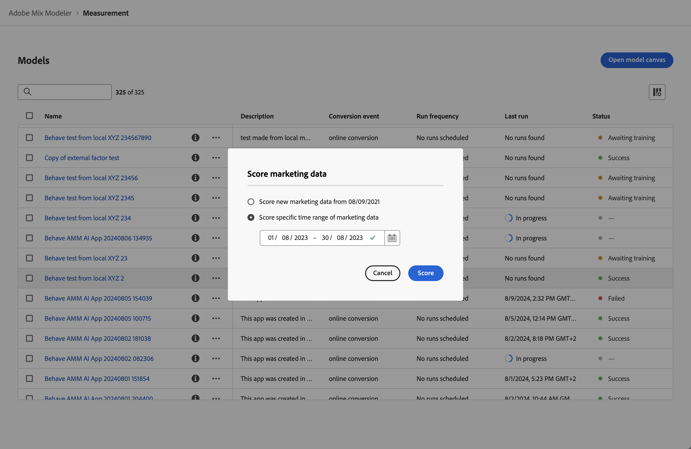

# 模型

Mix Modeler中的模型功能允许您配置、训练特定于业务目标的模型并对模型进行评分。 训练和评分支持在多触点归因和营销组合建模之间进行AI驱动的转移学习。

这些模型基于您在Mix Modeler应用工作流程中创建的统一数据。

Mix Modeler模型是一种机器学习模型，用于根据营销人员的投资来测量和预测指定的结果。 营销接触点和摘要级别的数据可用作输入。 Mix Modeler允许您根据不同的变量集、维度和结果（如收入、销量、商机）创建模型的变体。

模型需要：

* 一次转换。
* 一个或多个营销接触点（渠道）由摘要级别的数据、营销接触点数据（事件数据）或两者组成。
* 可配置的回顾时间范围。
* 可配置的培训窗口。

模型可以选择包括：

* 外部因素。
* 内部因素。
* 预先了解来自其他来源的营销贡献，例如以往的利益相关者经验、增量测试、其他模型。
* 支出份额，在营销数据稀疏时使用相对支出份额作为代理。

## 创建模型

要创建模型，请使用选择&#x200B;**[!UICONTROL Open model canvas]**&#x200B;时提供的Mix Modeler逐步引导模型配置流程。 有关详细信息，请参阅[创建模型](create.md)。

## 管理模型

要查看当前模型的表，请在Mix Modeler界面中：

1. 从左边栏中选择 **[!UICONTROL Models]**。

1. 您会看到当前模型的表。

   表列指定有关模型的详细信息。

   | 列名称 | 详细信息 |
   |---|---|
   | 名称 | 模型的名称 |
   | 描述 | 模型的描述 |
   | 转化事件 | 您为模型选择的转换。 |
   | 运行频率 | 训练模型的运行频率。 |
   | 上次运行 | 模型上次训练的日期和时间。 |
   | 状态 | 模型上次运行的状态。  成功 培训问题  正在等待训练 失败  _ （上次运行正在进行时） |

   {style="table-layout:auto"}

1. 若要更改为列表显示的列，请选择并打开或关闭列。

您可以对特定模型执行以下操作。

### 查看详细信息

要查看模型的更多详细信息，请执行以下操作：

1. 从左边栏中选择 **[!UICONTROL Models]**。

1. 为模型选择以显示包含详细信息的弹出窗口。

### 复制

您可以快速复制模型。

1. 从左边栏中选择 **[!UICONTROL Models]**。

1. 为模型选择，然后从上下文菜单中选择&#x200B;**[!UICONTROL Duplicate]**。

### 模型洞察

模型洞察功能仅适用于已成功训练和评分的模型。

要查看模型的见解，请执行以下操作：

1. 从左边栏中选择 **[!UICONTROL Models]**。

1. 选择模型名称。

您被重定向到[模型分析](insights.md)。

### 重新培训

重新训练模型仅适用于训练成功的模型。

在执行以下操作时，请考虑重新训练模型：

* 包括新的增量营销和因子数据。 例如，在上一季度，市场动态发生了变化或者您的营销数据分发发生了显着变化。

要重新训练模型，请执行以下操作：

1. 从左边栏中选择 **[!UICONTROL Models]**。

1. 为模型选择，然后从上下文菜单中选择&#x200B;**[!UICONTROL Train]**。 或者，从蓝色操作栏中选择 **[!UICONTROL Train]**。

   在&#x200B;**[!UICONTROL Train model]**&#x200B;对话框中，选择选项以：

   * **[!UICONTROL Train model with last 2 years of marketing data]**，或
   * **[!UICONTROL Train model using specific date range of data]**。
指定日期范围。 您可以使用选择日期范围。 您必须选择至少一年的数据范围。

   

1. 选择&#x200B;**[!UICONTROL Train]**&#x200B;以重新训练模型。

### 得分或重新得分

您可以根据新的营销数据对模型递增评分，或针对特定日期范围对模型重新评分。

当想要执行以下操作时，请考虑为模型重新评分：

* 更正不正确的营销数据。 例如，您在模型的训练和评分中包含的最近付费搜索数据漏掉了一周的数据。
* 使用新的增量营销数据，该数据可通过您配置作为协调数据一部分的数据集的更新获取。

要对模型评分或重新评分，请执行以下操作：

1. 从左边栏中选择 **[!UICONTROL Models]**。

1. 为模型选择，然后从上下文菜单中选择&#x200B;**[!UICONTROL Score]**。 或者，从蓝色操作栏中选择 **[!UICONTROL Score]**。

   在&#x200B;**[!UICONTROL Score marketing data]**&#x200B;对话框中，选择选项以：

   * **[!UICONTROL Score new marketing data from *mm/dd/yyyy *]**，使用新的营销数据对模型进行增量评分，或
   * **[!UICONTROL Score specific date range of marketing data]**以针对特定日期范围重新评分。
指定日期范围。 您可以使用选择日期范围。

   

1. 选择&#x200B;**[!UICONTROL Score]**。 使用特定数据范围对模型重新评分时，您会看到&#x200B;**[!UICONTROL Existing model is replaced]**&#x200B;对话框，提示您确认使用选定日期范围的新得分替换模型。 选择&#x200B;**[!UICONTROL Replace model]**&#x200B;以确认。

### 删除模型

要删除模型，请执行以下操作：

1. 从左边栏中选择 **[!UICONTROL Models]**。

1. 为模型选择，然后从上下文菜单中选择&#x200B;**[!UICONTROL Delete]**。 或者，从蓝色操作栏中选择 **[!UICONTROL Delete]**。

要删除多个模型，请执行以下操作：

1. 选择多个模型。

1. 从蓝色操作栏中，选择 **[!UICONTROL Delete]**&#x200B;以删除模型。

   >[!WARNING]
   >
   >模型将立即删除。

