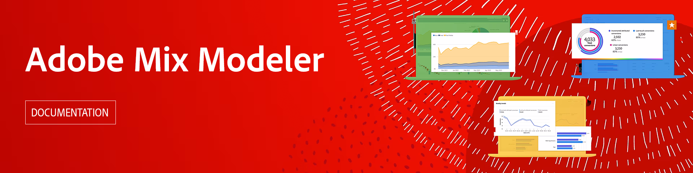

# AdobeMix Modeler指南

本技术文档指南提供了以下方面的自助帮助 **Adobe组合建模器**. Mix Modeler是一种Adobe Experience Cloud应用程序，可跨所有渠道（付费、免费和拥有）测量营销活动并全面优化规划。 Mix Modeler是基于Adobe Experience Platform构建的，由Adobe Sensei提供支持。

>[!AVAILABILITY]
>
>该产品将于2023年晚些时候推出。 可在此处找到草稿文档。

## 开始使用

* 什么是 [混合建模器](get-started/about.md)？

* 什么是典型的 [应用程序工作流](get-started/workflow.md)？

<!--
## Concepts

<table style="table-layout:fixed">
<tr>
    <td valign="top">
        
    

    <a href="/help/ingest-data/datasets.md"><strong>Datasets</strong></a>
    

    <em>Find out the various tools that you can use to troubleshoot your journeys.</em>
     
  </td>
  <td valign="top">
    
    

    <a href="using/usecase/building-the-journey.md"><strong>Use case</strong></a>
    

    <em>Learn how to create an advanced journey step-by-step.</em>
     
  </td>
  <td valign="top">
    
    

    <a href="using/expression/expressionadvanced.md"><strong>Building advanced expressions</strong></a>
    

    <em>Learn how to build complex expressions leveraging data from events and data sources. </em>
     
  </td>
</tr>
</table>
-->
