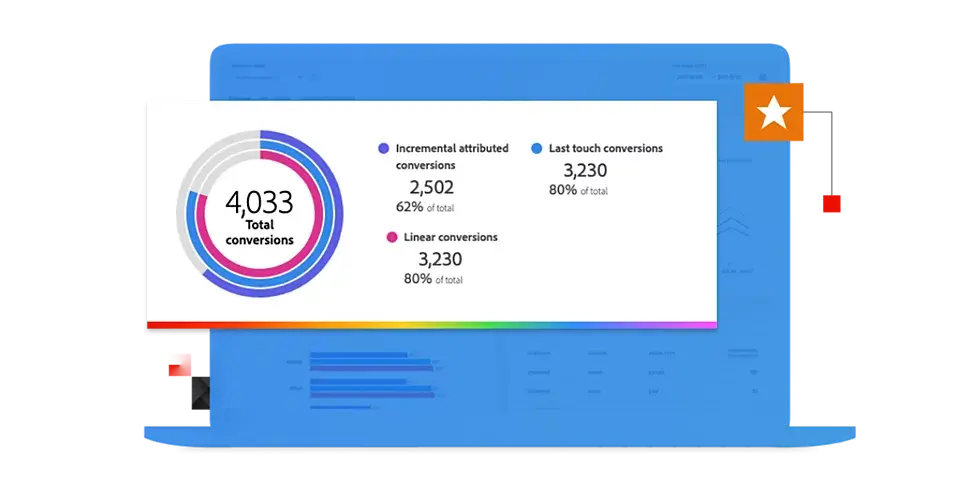

# Adobe Mix Modeler指南

本技术文档指南为Adobe提供自助帮助 **Mix Modeler**. Mix Modeler是一种Adobe Experience Cloud应用程序，可跨所有渠道（付费、免费和拥有）测量营销活动并全面优化规划。 Mix Modeler基于Adobe Experience Platform构建并由Adobe Sensei提供支持。

## 从基础知识开始

<table style="table-layout:fixed">
  <tr style="border: 0;">
    <td>
    
    
<strong>快速入门</strong> 大致了解Mix Modeler工作流程。

    </td>
    <td>
    
    
<strong>引入数据</strong> 了解如何将事件和汇总或汇总数据摄取到Mix Modeler。

    </td>
    <td>
    
    
<strong>协调数据</strong> 了解如何将聚合和事件数据同化到一致的数据视图中。 
    

    </td>
    <td>
    
    
<strong>模型和计划</strong> 训练您的模型并为其打分，并将这些见解用于您的营销计划。

    </td>
  </tr>
  <tr style="border: 0;">
    <td align="center"></td>
    <td align="center"></td>
    <td align="center"></td>
    <td align="center"></td>
    </tr>
</table>

## 浏览文档

<table style="table-layout:auto">
  <tr style="border: 0;">
    <td>
       
      <strong>引入数据</strong> <a href="/help/ingest-data/overview.md">概述</a> - <a href="/help/ingest-data/schemas.md">架构</a> - <a href="/help/ingest-data/datasets.md">数据集</a> 
    </td>
    <td>
       
      <strong>协调数据</strong> <a href="/help/harmonize-data/overview.md">概述</a> - <a href="/help/harmonize-data/fields.md">字段</a>  - <a href="/help/harmonize-data/dataset-rules.md">数据集规则</a> - <a href="/help/harmonize-data/marketing-touchpoints.md">营销接触点</a> - <a href="/help/harmonize-data/conversions.md">转化</a> - <a href="/help/harmonize-data/usage-report.md">使用情况报表</a>  
    </td>
    <td>
       
      <strong>模型</strong> <a href="/help/models/overview.md">概述</a> - <a href="/help/models/create.md">创建模型</a> - <a href="/help/models/insights.md">模型洞察</a> - <a href="/help/models/scoring-data.md">评分数据</a>
    </td>
  </tr>
  <tr style="border: 0;">
    <td>
       
      <strong>计划</strong> <a href="/help/plans/overview.md">计划</a> - <a href="/help/plans/create.md">创建计划</a> - <a href="/help/plans/compare.md">比较计划</a> - <a href="/help/plans/edit.md">编辑计划</a>
    </td>
    <td>
       
      <strong>概述</strong> <a href="/help/dashboard/overview.md">架构</a> - <a href="/help/dashboard/harmonized-data.md">协调的数据</a> - <a href="/help/dashboard/plans.md">计划</a>
    </td>
        <td>
       
      <strong>Tutorials</strong> <a href="https://experienceleague.adobe.com/docs/mix-modeler-learn/tutorials/overview.html?lang=en">概述</a> - <a href="https://experienceleague.adobe.com/docs/mix-modeler-learn/tutorials/intro/use-cases.html?lang=en">用例</a> - <a href="https://experienceleague.adobe.com/docs/mix-modeler-learn/tutorials/intro/user-workflow.html?lang=en">用户工作流</a>  - <a href="https://experienceleague.adobe.com/docs/mix-modeler-learn/tutorials/intro/user-interface-tour.html?lang=en">用户界面导览</a>
    </td>
  </tr>
</table>
