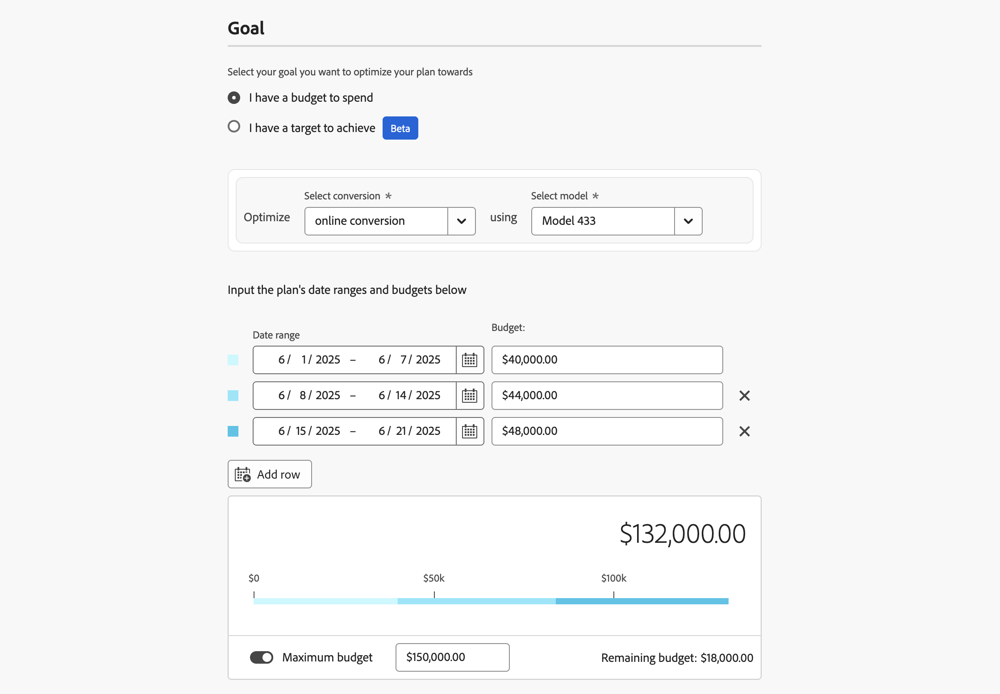

# 构建计划

在Mix Modeler中，您可以使用计划向导创建计划。 在计划向导中，您可以设置详细信息和预算，或计划的目标量度，以及用于计划的基础模型。 在指定详细信息、预算、目标量度和模型后，您可以继续使用人工智能推荐的计划或编辑按渠道划分的支出。 您可以选择定义高级配置，了解每次转换的平均收入和渠道成本。

您需要定义要针对其最大化计划的目标。 此目标可以是可支出的预算，也可以是希望实现的目标。 如果目标是目标，则另外还需要指定要使用的目标量度的值：转化、收入、CPA或ROI。

要创建计划，请在Mix Modeler的 **[!UICONTROL Plans]**&#x200B;界面中选择&#x200B;**[!UICONTROL Create plan]**。

1. 在&#x200B;**[!UICONTROL Plan creation]**&#x200B;屏幕中：

   1. 在&#x200B;**[!UICONTROL Setup]**&#x200B;部分中：

      1. 输入&#x200B;**[!UICONTROL Plan name]**，例如`Goal based plan`。 输入&#x200B;**[!UICONTROL Description]**，例如`A goal based plan`。
      1. 从&#x200B;**[!UICONTROL _中选择&#x200B;**&#x200B;[!UICONTROL Model]&#x200B;**选择一个选项……_.]**

         

   1. 在&#x200B;**[!UICONTROL Goal]**&#x200B;部分中，选择要优化计划的目标。 您可以选择

      * **[!UICONTROL I have a budget to spend]**

        

        此选项允许您为一个或多个日期范围输入预算。

         1. 在&#x200B;**[!UICONTROL Optimize]**&#x200B;容器中：
            1. 从&#x200B;**[!UICONTROL Select conversion]**&#x200B;下拉菜单中选择转换。
            1. 从&#x200B;**[!UICONTROL Select model]**&#x200B;下拉菜单中选择模型。
         1. 通过键入日期或使用选择日期范围来指定&#x200B;**[!UICONTROL Date range]**。
         1. 输入&#x200B;**[!UICONTROL Budget]**。
若要添加其他日期范围（每个日期范围都有预算），请选择 **[!UICONTROL Add row]**。
要删除日期范围和相关预算，请选择。
         1. 要定义要限制计划的可选最大预算，请执行以下操作：
            1. 打开&#x200B;**[!UICONTROL Maximize budget]**。
            1. 指定最大预算的金额。 金额应等于或高于为日期范围指定的预算总额。

      * **[!UICONTROL I have a target to achieve]** [!BADGE Beta]

        

         1. 在&#x200B;**[!UICONTROL Optimize]**&#x200B;容器中
            1. 从&#x200B;**[!UICONTROL Select conversion]**&#x200B;下拉菜单中选择转换。
            1. 从&#x200B;**[!UICONTROL Select target metric]**&#x200B;下拉菜单中选择一个目标量度。 您可以选择介于&#x200B;**[!UICONTROL Conversion]**、**[!UICONTROL CPA]**、**[!UICONTROL Revenue]**&#x200B;或&#x200B;**[!UICONTROL ROI]**&#x200B;之间。
            1. 从&#x200B;**[!UICONTROL Select model]**&#x200B;下拉菜单中选择模型。
         1. 通过键入日期或使用选择日期范围来指定日期范围。
         1. 输入所选目标度量的值。 例如，**[!UICONTROL Conversion]**&#x200B;的数字、**[!UICONTROL ROI]**&#x200B;的百分比或&#x200B;**[!UICONTROL CPA]**&#x200B;和&#x200B;**[!UICONTROL Revenue]**&#x200B;的货币值。
要添加其他日期范围（每个日期范围都有其目标指标），请选择 **[!UICONTROL Add row]**。
要删除日期范围和关联的目标量度，请选择。
         1. 要定义要限制计划的可选最大预算，请执行以下操作：
            1. 打开&#x200B;**[!UICONTROL Maximize budget]**。
            1. 指定最大预算的金额。

   1. 选择 **[!UICONTROL Next]**。

1. 在&#x200B;**[!UICONTROL Done with all required fields]**&#x200B;对话框中：

   

   * 如果要生成具有预测的ROI的AI推荐计划，请选择 **[!UICONTROL Create plan now]**。 选择&#x200B;**[!UICONTROL OK]**。 您的计划已创建。

   * 如果您要在创建具有预测的ROI的计划之前编辑渠道预算并定义高级配置，请选择 **[!UICONTROL Edit channel budgets first]**。  选择&#x200B;**[!UICONTROL OK]**，这样您就可以在下一步的&#x200B;**[!UICONTROL Spend selection]**&#x200B;中定义渠道支出。

     >[!IMPORTANT]
     >
     >以下信息仅与您选择的 **[!UICONTROL Edit channel budgets first]**&#x200B;相关

1. 在&#x200B;**[!UICONTROL Spend selection]**&#x200B;部分中，对于每个预算日期范围，使用打开该数据范围的渠道分配视图。

   如果您想要使用过去的营销支出数据和见解，则可以使用历史引用数据。 将历史引用数据考虑在内：

   * 通过突出显示高性能渠道和性能不佳的渠道来改进预算分配。
   * 支持趋势分析。
   * 在配置计划时，确定有效策略并避免错误。

   如果选择历史参考期，则需调整以前的支出模式首选项，Mix Modeler的计划功能可生成符合您期望的计划。 这些计划最终应增强利益相关者的信心，确保营销计划是战略性的、高效的，并且这些计划以经验证的绩效数据和业务需求为基础。

   

   1. 选择 **[!UICONTROL Spend pattern]**。

      * 默认选项为&#x200B;**[!UICONTROL Automatic]**。
      * 选择&#x200B;**[!UICONTROL Historical reference]**&#x200B;并输入&#x200B;**[!UICONTROL Start date]**&#x200B;以引用Mix Modeler已可用的以往营销支出数据。 **[!UICONTROL End date]**&#x200B;是根据您定义支出模式的日期范围自动确定的。 建议的开始日期是第一个可用的过去营销支出日期。 为了指示您选择了不存在或无效的历史引用时段，您会看到。

   1. 要定义每个渠道的预算，请为&#x200B;**[!UICONTROL Min]**&#x200B;和&#x200B;**[!UICONTROL Max]**&#x200B;输入值或使用滑块。

   1. 要在货币或百分比输入之间切换，请为&#x200B;**[!UICONTROL View spend by]**&#x200B;选择&#x200B;**[!UICONTROL $]**&#x200B;或&#x200B;**[!UICONTROL %]**。 如果您选择了不基于货币的目标量度，则此切换处于禁用状态。

   1. 完成后，选择&#x200B;**[!UICONTROL Create]**。

      

   1. 选择 **[!UICONTROL Next]**。

1. 在&#x200B;**[!UICONTROL Advanced configurations]**&#x200B;部分中，您可以输入可选的高级配置。

   

   * 汇总您的计划名称、模型、日期范围和总预算。

   * 默认情况下，Mix Modeler会使用最新的历史季节性数据自动计算每次转换的平均收入。 在&#x200B;**[!UICONTROL Average Revenue per conversion]**&#x200B;中，您可以定义每次转换的特定平均收入。

      1. 对于预算中的每个日期范围：

         1. 从&#x200B;**[!UICONTROL Date range]**&#x200B;下拉菜单中选择一个日期范围。
         1. 输入&#x200B;**[!UICONTROL Average revenue]**&#x200B;值。

      1. 选择添加每个转化单位的自定义平均收入以添加日期范围。
      1. 选择以删除日期范围。

     >[!NOTE]
     >
     >如果您的模型不包括历史收入数据，则必须为为预算指定的每个日期范围定义每次转换的平均收入。
     >

   * 默认情况下，Mix Modeler会使用最新的历史季节性数据自动计算渠道成本。 在&#x200B;**[!UICONTROL Channel costs]**&#x200B;中，您可以定义自定义渠道成本。

      1. 对于模型中的每个渠道，定义自定义渠道成本。

         1. 从&#x200B;**[!UICONTROL Channel]**&#x200B;下拉菜单中选择一个渠道。
         1. 对于预算中的每个日期范围：
            1. 从&#x200B;**[!UICONTROL Date range]**&#x200B;下拉菜单中选择一个日期范围。
            1. 输入&#x200B;**[!UICONTROL Average revenue]**&#x200B;值。
         1. 选择 **[!UICONTROL Add custom average revenue per conversion unit]**&#x200B;以添加日期范围。
         1. 选择以删除日期范围。

      1. 选择 **[!UICONTROL Add custom channel cost]**&#x200B;以添加频道。
      1. 选择以删除自定义渠道。

1. 完成后，选择&#x200B;**[!UICONTROL Create]**。

1. 在&#x200B;**[!UICONTROL Create plan]**&#x200B;对话框中，选择&#x200B;**[!UICONTROL Create plan]**&#x200B;以创建您的计划。 选择&#x200B;**[!UICONTROL Cancel]**&#x200B;以取消计划的创建。 将显示&#x200B;**[!UICONTROL No work is saved]**&#x200B;对话框以确认。

