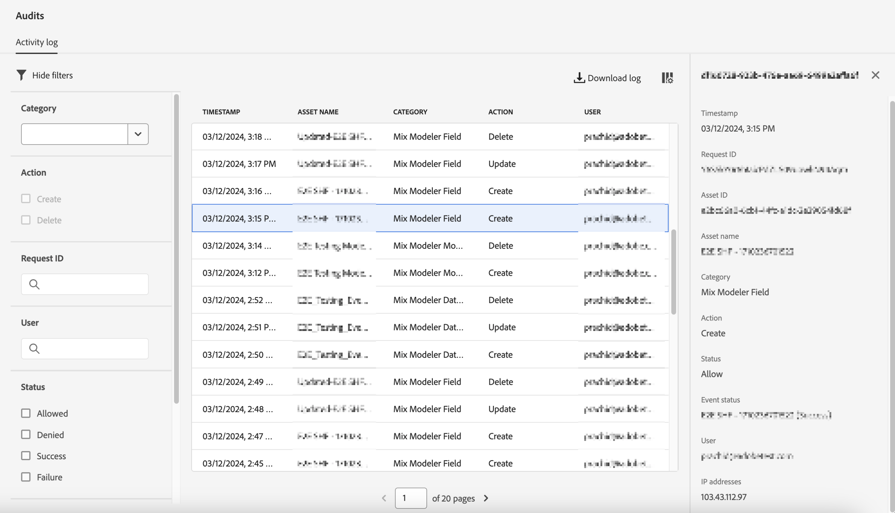

# 审核

>[!AVAILABILITY]
>
>本文中描述的功能处于版本的有限测试阶段，可能尚未在您的环境中可用。 当功能正式可用时，将删除此注释。 有关最新Mix Modeler版本的信息，请参阅 [Mix Modeler版本](/help/releases/latest.md).

您可以使用Experience Platform的审核界面部分并嵌入到Mix ModelerUI中，审核Mix Modeler正在执行的操作。

要检查审核日志，请在Mix Modeler界面中：

1. 选择  **[!UICONTROL Audits]** 从 **[!UICONTROL PRIVACY]**.

1. 在 **[!UICONTROL Audits]** 您可以找到 **[!UICONTROL Activity log]**. 活动日志将显示以下Mix Modeler类别、操作和状态的条目。

   | 类别 | 操作 | 状态 |
   |---|---|---|
   | Mix Modeler数据集规则 | 创建 | 允许或拒绝 |
   | Mix Modeler数据集规则 | 更新 | 允许或拒绝 |
   | Mix Modeler数据集规则 | Delete | 允许或拒绝 |
   | Mix Modeler字段 | 创建 | 允许或拒绝 |
   | Mix Modeler字段 | 更新 | 允许或拒绝 |
   | Mix Modeler字段 | Delete | 允许或拒绝 |
   | Mix Modeler营销接触点 | 创建 | 允许或拒绝 |
   | Mix Modeler营销接触点 | 更新 | 允许或拒绝 |
   | Mix Modeler营销接触点 | Delete | 允许或拒绝 |
   | Mix Modeler转换 | 创建 | 允许或拒绝 |
   | Mix Modeler转换 | 更新 | 允许或拒绝 |
   | Mix Modeler转换 | Delete | 允许或拒绝 |
   | Mix Modeler模型 | 创建 | 允许或拒绝 |
   | Mix Modeler模型 | 更新 | 允许或拒绝 |
   | Mix Modeler模型 | Delete | 允许或拒绝 |

1. 在活动日志中选择一个条目，以打开面板了解更多详细信息。

   

1. 筛选依据 **[!UICONTROL Category]**， **[!UICONTROL Action]**， **[!UICONTROL Request ID]**， **[!UICONTROL User]**， **[!UICONTROL Status]** 或 **[!UICONTROL Date]** 范围，选择 .

1. 要修改活动日志中显示的列，请选择  和 **[!UICONTROL Customize table]** 对话框选择要显示的列。 选择 **[!UICONTROL Apply]** 要应用所选内容， **[!UICONTROL Cancel]** 以取消选择。

1. 要下载审核日志，请选择  **[!UICONTROL Download log]**. 在 **[!UICONTROL Download log]** 对话框选择 **[!UICONTROL CSV]** 或 **[!UICONTROL JSON]** 作为格式，然后选择 **[!UICONTROL Download]**.
